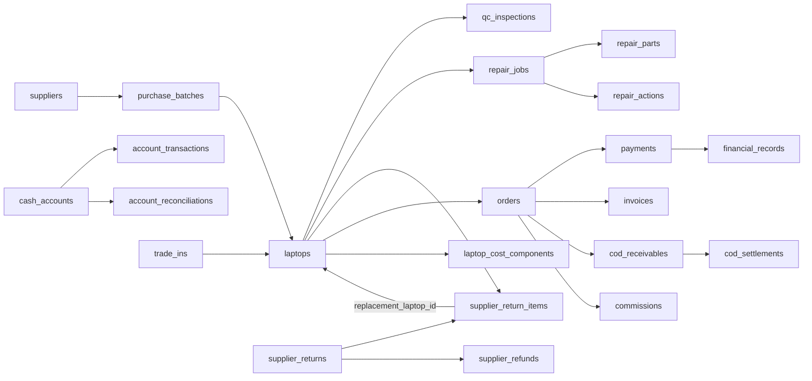

# Database Audit — Cloudflare D1

Audit: 2026-10-07 UTC / hoàn thiện 2026-10-08 Asia/Bangkok. Checkout: `feature/cloudflare-db-migration`, HEAD `1af134fdbd5465d717f66fd155115fc1078b1334`.

## 1. Executive Summary

**NEEDS REFACTOR — sửa có mục tiêu ở integrity và workflow; không cần thiết kế lại database.** Mô hình một laptop xuyên suốt vòng đời phù hợp CitiLap. D1 prepared statements, batch tài chính và các partial unique index cho QC/repair/return là nền tảng tốt. Tuy nhiên, đường ghi order chưa có atomic allocation và ràng buộc độc quyền máy; luồng refund xung đột với CHECK tổng cọc; retry repair có thể phá trạng thái máy; chứng từ/snapshot chưa được bảo vệ nhất quán.

**Bằng chứng live quan trọng:**

| Kiểm tra | Kết quả tại thời điểm đọc |
|---|---|
| Application tables / columns | **43 / 551** (bao gồm auth/storage/import, gồm generated columns) |
| Indexes trên application tables | **106 = 52 explicit + 54 automatic PK/UNIQUE**; toàn DB có 107, gồm 1 index nội bộ Cloudflare |
| Views / triggers | **7 / 5** |
| Internal tables loại khỏi tổng trên | `d1_migrations`, `_cf_KV`, `sqlite_sequence`; sqlite_schema tổng 46 tables |
| Migration remote | **20/20 tên migration**, đến `0020_integrity_consolidation.sql`; không khẳng định checksum/deployed Worker khớp checkout |
| Foreign key check | **0 vi phạm** |
| Đơn chốt nhưng laptop không sold | **1: order 41, laptop 1463, order=done/paid, laptop=available, laptop_locked=0** |
| Snapshot sale thiếu thời điểm | **30/42 đơn shipping/done**; 12 có `cost_snapshotted_at` |
| Hai order active cùng laptop | **0** hiện có; schema vẫn thiếu bảo vệ concurrency |
| Paid vs payments, debt formula, payment→financial cardinality, payment→cash amount/link | **0 sai lệch** trong các truy vấn đã chạy |
| Procurement aliases lệch | **0**; trigger 0020 đang hiện diện |
| Header lô vs view status | **2**; khác mô hình state, không tự coi là corruption |
| Finance/QC data | 76 payments, 76 financial records, 76 account transactions; 128 QC sessions |
| Refund, repair, supplier return/refund, COD live | Các bảng này hiện **0 rows**; không thể suy ra workflow an toàn từ dữ liệu rỗng |

Evidence: [schema](database-audit-assets/remote-schema.json), [columns](database-audit-assets/remote-columns.json), [counts](database-audit-assets/remote-counts.json), [integrity SQL/results](database-audit-assets/integrity.json), [follow-up](database-audit-assets/followup.json), [migration history](database-audit-assets/remote-migrations.json).

Scope chỉ đọc: không apply migration, không đổi schema/index/constraint/business logic, không gọi mutation API, không tạo account. Chỉ thêm báo cáo và script evidence dưới `docs/`. Không chạy bộ test có seed/DDL do yêu cầu không chạy migration. Không có HTTP role E2E, thử concurrent writes, fault injection hoặc browser QA trong audit này. Findings concurrency là phân tích code + schema; trạng thái order 41 và 30 missing snapshots là dữ liệu live, chưa xác định nguyên nhân lịch sử.

Các truy vấn remote không nằm trong một transaction dài; đây là ảnh chụp theo nhiều lần đọc, có thể thay đổi khi người dùng vận hành. Kết quả thành công có `rows_written=0`, `changed_db=false`. Hai table-valued PRAGMA cho FK/index bị D1 trả `SQLITE_AUTH`; dùng DDL lấy từ `sqlite_schema` để xem quan hệ/constraint, không né quyền. Profile rộng ban đầu gặp giới hạn aggregate, đã chia nhỏ và đọc lại. Không thu password hash, token hay thông tin liên hệ khách hàng vào báo cáo.

## 2. Database Architecture Overview

- Runtime: Next.js 16.3.7 / React 19, OpenNext Cloudflare Workers; binding `DB` trong [wrangler.jsonc](../wrangler.jsonc); R2 cho ảnh/cache. `getCloudflareBindings()` lấy binding theo request, không cache global.
- Không dùng Prisma/Drizzle/Kysely. [database.mjs](../lib/cloudflare/database.mjs) là adapter custom `from().select()/insert()/update()` và `rpc()`; `rpc()` chỉ dispatch JavaScript, **không phải stored procedure trong D1**.
- SQL ở `lib/cloudflare/*.mjs`; [query.mjs](../lib/cloudflare/query.mjs), [mutation.mjs](../lib/cloudflare/mutation.mjs), [selection.mjs](../lib/cloudflare/selection.mjs) bind values và allow-list identifiers qua metadata. `schema.json` dùng tên type `jsonb` để encode/decode; storage thật là SQLite TEXT + `json_valid`.
- Không thấy lời gọi `withSession()` trong lớp binding/adapter đã đọc; ghi chú PROJECT_CONTEXT “D1 session” không được hiểu là đang dùng D1 Sessions API. Auth session là bảng riêng.
- Migration canonical: `db/d1/migrations/0001…0020`; remote đã có đủ 20 tên. DDL schema ban đầu sinh từ catalog lịch sử, nhưng runtime không có Supabase fallback/network client.
- Core: procurement/supplier → laptop → QC/repair/return → order/payment/invoice; cash/receivable/COD/commission; trade-in; roles/settings/audit.
- Không có procurement_items, shipment_items, order_items riêng. Mỗi laptop là purchase detail, mỗi order hiện gắn một laptop. Không thêm junction/table chỉ để mô phỏng mô hình doanh nghiệp lớn.

D1 batch rollback, FK enforcement, index và type recommendations được đối chiếu với tài liệu chính thức: [D1 batch](https://developers.cloudflare.com/d1/worker-api/d1-database/), [D1 foreign keys](https://developers.cloudflare.com/d1/sql-api/foreign-keys/), [indexes](https://developers.cloudflare.com/d1/best-practices/use-indexes/), [limits](https://developers.cloudflare.com/d1/platform/limits/), [SQLite type affinity](https://www.sqlite.org/datatype3.html). Không đề xuất RLS, advisory lock, PostgreSQL enum hoặc transaction tương tác qua nhiều `await` như PostgreSQL.

## 3. Database Map

Mọi bảng đều có purpose nhận diện được. [Bản đồ chi tiết](database-audit-assets/database-map.md) chứa **toàn bộ DDL hiện tại** cho từng bảng: PK, FK/direction/delete behavior, toàn bộ columns, UNIQUE/CHECK, indexes kể cả autoindexes, inbound relations, runtime references và CRUD candidates. Domain “logistics” hiện nằm trên laptops; receivable/payable/balance/analytics chủ yếu là views, không phải bảng bị thiếu.

| Table | Domain | Purpose / Workflow | Primary key | Columns | Live rows | Modules |
|---|---|---|---|---:|---:|---|
{{TABLE_MAP}}

## 4. Table Audit

ACTIVE nghĩa là có workflow/consumer, không có nghĩa đang có dữ liệu live. QUESTIONABLE DESIGN vẫn là bảng cần dùng, không phải đề xuất xóa.

| Table | Classification | Purpose | Recommendation |
|---|---|---|---|
{{TABLE_AUDIT}}

Không có bảng nào đạt evidence để đánh dấu UNUSED hoặc safe-to-drop. `qc_check_items` là ứng viên legacy có reader; `sheet_import_sources` là nguồn audit import, có 250 rows. Không đánh dấu repair/COD/commission không dùng chỉ vì đang rỗng.

## 5. Column Audit

**Coverage: đủ 551 column rows.** Phân loại: {{COLUMN_CLASSES}}.

Bảng kết hợp metadata live, thống kê null/distinct/nonempty và tham chiếu trong runtime, migration/import/test. [Reference inventory đầy đủ](database-audit-assets/column-references.json) lưu các vị trí, gồm cả reader qua wildcard/JSON và references ngoài runtime. `USED` ở các cột thông thường là evidence truy cập/projection, không bảo đảm có consumer business riêng cho từng thuộc tính. Các token phổ biến như `id/status/name` trong cùng module có thể thuộc alias khác; không dùng chúng để quyết định DROP. Các cột có kết luận nghiệp vụ đặc biệt đã được override sau trace service/view/API. `WRITE_ONLY` chỉ mô tả đường nghiệp vụ chủ yếu, không phủ nhận API `SELECT *` có thể trả cột đó.

Null/distinct không chứng minh dead schema. Bảng rỗng có distinct=0; generated column được tính trong tổng. Kiểu NUMERIC là affinity, không phải decimal chính xác. PK `INTEGER PRIMARY KEY` thực tế không nhận NULL lưu trữ dù PRAGMA có thể báo `notnull=0`.

| Table | Column | Classification | Evidence | Recommendation |
|---|---|---|---|---|
{{COLUMNS}}

## 6. Unused Columns

**0 cột được chứng minh UNUSED / safe-to-remove.** Không đủ căn cứ để DROP. Không nhầm alias, historical metadata, snapshot, generated column hoặc column chỉ được projection với không có giá trị.

## 7. Possibly Unused Columns

{{POSSIBLE}}

Các ứng viên trên cần đọc consumer gián tiếp, export/import và dữ liệu lịch sử trước khi quyết định. Cột `procurement_flow` còn writer tạo DIRECT, default LEGACY và constraint; đổi workflow không đồng nghĩa xóa ngay cột.

## 8. Legacy Tables / Columns

- `qc_check_items`: `GET /api/qc?id=…` vẫn đọc. Live 0 rows; giữ đến khi retirement reader và bảo toàn history ở các môi trường khác.
- `qc_inspections.detail_snapshot/overall_notes/mainboard_status/charger_status/cosmetic_grade`: dữ liệu cũ/import. Live có **123/128 detail_snapshot**, **123 overall_notes không rỗng**; không phải cột rỗng có thể bỏ.
- `purchase_batches.procurement_flow`, tổng header, nhiều trạng thái logistics cũ còn trong CHECK. Runtime direct intake đã dùng laptop làm detail; view status khác header.
- `laptops.price_rmb/exchange_rate`: alias compatibility còn runtime read/write và 3 triggers sync. Khác với `tracking_code` của laptops đã bị bỏ trong 0018; `orders.tracking_code` vẫn là tracking giao khách hợp lệ.
- `TECH` còn trong DB CHECK/compatibility queries, runtime normalize thành TECHNICAL. Không thêm lại role TECH như source độc lập.

## 9. Supabase Legacy Cleanup

| Location | Legacy item | Still used? | Recommendation |
|---|---|---|---|
| `PROJECT_CONTEXT.md:23`, phần reset và advisory lock | Supabase connection, postgres reset, transaction semantics cũ | Tài liệu lịch sử gây nhầm | R14: tách tài liệu vận hành hiện tại; remote đã có 0020 |
| `lib/apiAuth.js:7–47` | `legacyBearerClient=()=>null`, nhánh `auth.getUser()` không thể chạy | Dead branch trong file còn dùng validation | R12: bỏ nhánh sau test cookie auth; không coi là auth bypass |
| `lib/apiFetchers.js` | Comment Supabase/RLS | Comment | R12, ưu tiên thấp |
| `lib/cloudflare/schema.json`, `query.mjs`, `mutation.mjs` | type label `jsonb`, mã `PGRST116`, cú pháp relation | **Có**, metadata compatibility | Giữ chức năng encode/selection; rename chỉ khi có lợi ích |
| `qa/build-d1-schema.mjs`, `qa/build-d1-views.mjs`, `docs/cloudflare/postgres-catalog.json` | Generator đọc catalog PostgreSQL lịch sử | Có thể chạy bằng tay, không phải runtime | R14: không dùng tái sinh baseline đã deploy từ catalog cũ |
| `db/migrations/`, `supabase/migrations/`, `db/migrations_archive/`, `init_full_db.sql`, `reseed_data.sql` | Schema/RPC/reset cũ | Historical/test toolchain | Archive và ghi nhãn rõ, không chạy lên D1 |
| `package.json` dev dependency `@electric-sql/pglite` | Engine cho legacy QA | Không runtime D1 | Giữ đến khi retire test phụ thuộc; không tự xóa dependency |
| `docs/cloudflare/source-inventory.json`, operation coverage, các QA cũ | Inventory/report trước port | Reference | Đừng dùng count cũ làm bằng chứng hiện tại |

Không kiểm tra nội dung secrets/env để in ra báo cáo. Dependency runtime không có Supabase SDK. `rpc` và jsonb label không chứng minh còn PostgreSQL backend.

## 10. Redundant / Duplicated Data

| Location | Problem | Risk | Recommendation |
|---|---|---|---|
| laptop purchase fields và aliases | Hai tên cho cùng giá/tỷ giá | Có writer compatibility; 0020 giảm drift | R12 chuyển DTO, giữ canonical purchase_* |
| orders.amount_paid/debt_amount/cod_amount/deposit_amount | Cache ledger và tổng cọc lịch sử | Mỗi luồng cập nhật riêng, refund CHECK mâu thuẫn | R03, R09; không xóa cache trước khi thay query |
| orders.profit_vnd vs snapshots | Current profit và historical profit khác thời điểm/đơn vị | UI/analytics dùng nhầm | R04/R12 đặt tên nghĩa rõ, snapshot không tính lại |
| purchase header totals vs laptops/view | Tổng lúc tạo vs tổng hiện tại | Payable không dùng header, tên gây hiểu nhầm | R07/R12 loại reader sai trước |
| laptop technical summary vs qc_details | screen/mainboard/camera có hai writer | Summary lỗi thời nếu sửa JSON trực tiếp | R10 chốt canonical QC, derive projection |
| financial_records vs account_transactions | Báo cáo thu/chi và sổ tiền khác phạm vi | Cộng hai sổ thành doanh thu kép | R15 quy định metric; giữ cash ledger |
| supplier_return header/item status | Hai cấp giải quyết | REJECTED không sync item | R07 sửa transition, không gộp bảng máy móc |

## 11. Intentional Snapshots

Giữ `orders.cost_snapshot_*`, gross/direct/net contribution, `invoices.snapshot`, `commissions.calculation_snapshot_json`, số dư đối soát, `operation_requests.result`, payload import và QC snapshot lịch sử. Chúng ghi lại **thời điểm khác** với dữ liệu hiện tại. Customer/address trong order cũng có giá trị tại giao dịch; FK customer không thay thế hoàn toàn thông tin chứng từ.

Snapshot COGS theo policy hiện tại lấy `laptops.import_price_vnd * 1e6` khi chốt, không tự đổi sang landed cost. Đừng backfill 30 đơn bằng giá vốn hiện tại rồi gọi là “giá vốn lúc bán”; cần chứng từ/import có thể chứng minh hoặc gắn LEGACY/INCOMPLETE.

## 12. Source of Truth Review

| Business concept | Current source | Issues | Recommended source of truth |
|---|---|---|---|
| Laptop current state | laptops.status + orders/reservations/technical workflows | Non-atomic order sync, retry repair | laptops.status là projection canonical được service duy nhất cập nhật cùng batch |
| Purchase price | laptops.purchase_price_rmb, purchase_exchange_rate | aliases còn tồn tại | purchase_* + shipping_rmb; payment tỷ giá thực tế là sự kiện khác |
| Import price quản trị | laptops.import_price_vnd (triệu VND) | Default 0 có thể bị coi COMPLETE | Giá explicit hoặc công thức tại nhập; completeness phải phân biệt thiếu/0 |
| Landed cost | laptop_landed_costs view + cost_components | unified_inventory cùng tên nhưng chỉ base+shipping | Giữ cost view cho landed cost; đổi nhãn base cost projection |
| Sale price | orders.sale_price (triệu VND) | Có thể sửa sau snapshot/invoice | Mutable pre-commit; post-commit dùng correction policy |
| Sale COGS | orders.cost_snapshot_vnd (VND) | 30 missing; capture đọc laptop ngoài batch | Snapshot immutable có timestamp và source/policy |
| Supplier payable | purchase_batch_summaries debt_rmb | Header trạng thái CANCELLED/CLOSED bị view che, replacement chưa rõ nghĩa vụ | Debt từ purchase liability và payments; operational status tách receipt status |
| Supplier refund | supplier_refunds + agreed/expected items | OFFSET vẫn ghi cash IN; header/item transition | Refund ledger canonical; OFFSET phải là offset liability, không cash |
| Customer receivable | orders.debt_amount cache + receivable view | Trade-in/cancel routes có policy riêng | Derive từ sale, net payments, accepted credit; sync atomic |
| Cash balance | opening_balance + account_transactions | Text comparison vs julianday; reconciliation thiếu cutoff | Một công thức theo cùng convention UTC/cutoff |
| COD balance | expected_cod_amount_vnd - settlements | Delivered payment không phải cash received | cod_receivables/settlements; cash chỉ settlement |
| Repair state | repair_jobs.status + outcome | COMPLETED không có nghĩa REPAIRED | Giữ status và outcome riêng; laptop quay QC đúng một lần |
| QC current / history | laptops.qc_details / qc_inspections | New quick QC không snapshot chi tiết | Giữ current canonical; history result/time; nói rõ giới hạn history chi tiết |
| Return state | supplier_returns + items | REJECTED item chưa terminal | Header summary từ item hoặc transition đồng bộ có kiểm tra |
| User role | user_profiles.role | TECH alias tồn tại | roles.mjs canonical + server session authorization |

## 13. Questionable Schema Design

| Area | Current design | Problem | Better design |
|---|---|---|---|
| Order status | Nullable TEXT, không CHECK enum workflow | Arbitrary/NULL state có thể bypass predicate | R11 finite CHECK + NOT NULL sau clean data |
| Mixed money units | import_price_vnd/sale_price là triệu; snapshot/cash là đồng | Tên `_vnd` không đủ nói đơn vị, NUMERIC lưu real | Boundary conversion rõ; tiến tới integer minor units theo domain |
| Direct domestic intake | source_type mặc định UNKNOWN, source_reference_id là supplier ID, tạo available | “UNKNOWN” vừa chưa rõ nguồn vừa nguồn nội địa đã biết; bypass QC có chủ ý? | R10 chốt policy domestic intake, source enum/reference rõ |
| Polymorphic references | source_type/source_id; reference_type/reference_id | Không thể dùng FK đơn vào nhiều bảng | Service batch kiểm tra existence + ownership; không tạo FK giả |
| Warranty | laptop_id nullable/SET NULL; status free text; roles ALL | Có thể mất lineage/history, quyền rộng | R10/R11 bảo toàn máy và role/action policy |
| Repair summary | parts_cost stored, total generated | Parts cache phải sync mọi writer | Giữ generated total; khóa sửa sau completion, kiểm tra parts sum |

PK strategy pha INTEGER cho core và TEXT UUID cho workflow/auth phù hợp, không có lý do đổi toàn bộ. SQLite INTEGER PRIMARY KEY hiệu quả cho row lookup; UUID cho record tạo trước batch cũng thực dụng. Random UUID SQL dài không đủ lý do migration ID hàng loạt.

## 14. Missing Constraints

1. **UNIQUE quan trọng nhất:** active owner của `orders.laptop_id`. Index hiện tại chỉ non-unique. Partial unique với predicate owner thống nhất cần kết hợp guarded batch để bảo vệ laptop state và reservation ở bảng khác (R01).
2. **CHECK + NOT NULL:** `orders.order_status/payment_status`, `laptops.status/is_active`, `orders.is_active/laptop_locked`; CHECK `IN` cho nullable không chặn NULL. `warranty_cases.laptop_id/status/reported_issue` phù hợp required API, cần preflight historical rows trước rebuild (R11).
3. **CHECK tài chính:** cash currency khớp tài khoản không thể biểu diễn bằng row CHECK đơn giản; kiểm tra trong batch. VND whole-unit columns cần integer/value validation phù hợp; không thêm integer CHECK lên cột đang lưu triệu VND (R11).
4. **FK không thiếu ở các quan hệ chính:** supplier→batch, batch→laptop, laptop→QC/repair/order/return, order→payment/COD/invoice, cash→transactions đều có. DDL chi tiết trong database map. Actor text là historical display/label, không tự ép tất cả thành FK user.
5. **Cross-record ownership chưa được enforce đầy đủ:** supplier return item qc_inspection_id/repair_job_id có FK existence nhưng `createSupplierReturn` không so laptop của QC/repair với item. Warranty order/laptop match chỉ pre-read API. R07/R11 kiểm tra trong batch; composite FK chỉ sau chứng minh lợi ích, không mass-add FK.
6. **Financial record per payment:** live đúng 1:1, DB chưa UNIQUE `financial_records.payment_id`; nếu policy tiếp tục một projection/payment, cân nhắc partial UNIQUE sau khi loại correction đa dòng. Không áp đặt nếu chuyển sang ledger correction entries (R15).

Không đề xuất UNIQUE tracking: một kiện nhiều máy là workflow hợp lệ. Serial đã unique case-insensitive/trim cho nonempty; idempotency payment, one active QC/repair/return/reservation đã có. `purchase_batches UNIQUE(id,supplier_id)` không phải thừa để xóa nếu FK composite supplier payment dùng cặp đó.

## 15. Relationship Review

- FK live sạch không bảo đảm “đơn giao là máy đã QC”. Bảo vệ quan hệ nghiệp vụ cần cùng transaction với mutation.
- Return replacement có unique `replacement_laptop_id`, check supplier và trạng thái in_transit/waiting_qc; không tạo replacement available trực tiếp.
- Các bảng money chính dùng RESTRICT nhiều chỗ, phù hợp bảo toàn lịch sử. Orders→laptops và một số history dùng SET NULL: không mất row nhưng có thể mất lineage; tránh expose hard delete máy đã có nghiệp vụ. Không chuyển finance sang CASCADE.
- CASCADE hiện hữu auth_sessions/profile khi xóa auth user là hợp lý; QC checklist/repair children cần policy giữ parent lịch sử. Không gọi CASCADE là sai nếu parent chỉ được xóa ở reset đặc biệt.
- Supplier return giữ header/items/refunds/events vì phiếu có nhiều máy, nhiều lần hoàn và nhiều mốc xử lý; gộp thành một bảng sẽ mất partial refund và trace replacement.
- `source_reference_id`, `repair_jobs.source_id`, cash reference và audit entity là polymorphic; document namespace và validate ownership. `source_reference_id` domestic supplier vs trade-in vs intake key là một điểm semantics còn yếu.

## 16. Index Review

[Inventory tất cả indexes](database-audit-assets/index-review.md), gồm định nghĩa exact và autoindexes. Không phát hiện cặp explicit indexes có cùng định nghĩa exact; **chưa kết luận semantic redundancy** giữa expression/partial indexes từ tên/index prefix.

### Missing indexes

Live EXPLAIN: `repair_actions WHERE repair_job_id=? ORDER BY performed_at` → SCAN + temp sort; `repair_parts WHERE repair_job_id=?` → SCAN. API thực tế parts thêm ORDER BY created_at. Candidate `(repair_job_id, performed_at)` và `(repair_job_id, created_at)` (R13). Bảng hiện rỗng, cải thiện chưa đo latency.

Orders enrichment commissions theo order_id không loại CANCELLED; partial `commissions_source_unique` không dùng cho query này, EXPLAIN SCAN. Candidate `commissions(order_id)` nếu module được dùng (R13). Không gọi đây là bottleneck hiện tại.

### Redundant indexes

Chưa có index đủ căn cứ safe-to-remove. Header PK+supplier UNIQUE có thể phục vụ composite FK. Đừng xóa partial unique chỉ vì bảng rỗng hoặc planner không dùng nó cho SELECT.

### Duplicate indexes

Không thấy exact duplicate explicit definitions trong remote catalog. 54 autoindexes trên application tables là PK/UNIQUE được engine quản lý, không phải 54 indexes được tạo dư.

### Composite index opportunities

Hai query tháng thử nghiệm dùng `idx_orders_month_key` và `idx_laptops_month_key` mà không có temp sort cho ORDER BY id. Chưa cần thêm `(month_key,is_active,id)` ngay. EXPLAIN là representative shape, không bao phủ mọi filter/ORDER BY của UI.

Tracking substring `lower(tracking_code_cn) LIKE '%…%'` SCAN; expression index partial không giải quyết leading wildcard. Giữ search như hiện tại ở 193 máy; ưu tiên exact/prefix rồi mới cân nhắc FTS nếu có số liệu thực tế. [D1 index guidance](https://developers.cloudflare.com/d1/best-practices/use-indexes/) nhấn mạnh index theo query được dùng, không tạo hàng loạt.

## 17. Query Performance

- `app/api/intake/route.js:14` allRows loop range 500: giảm kích thước mỗi request nhưng vẫn fetch toàn bộ kết quả; receiving/ALL và correlated relation selection có thể tăng row reads/round trips.
- `app/api/repairs/route.js:41` danh sách không LIMIT; nested trade-in checks và JSON relation projection cũng cần theo dõi. Không áp pagination làm mất record trên UI mà không cập nhật client.
- `remaining.getManagementDashboard`: fetch toàn bộ available laptops, JS tính aging rồi sort/slice 25; có thể aggregate/bucket và limit trong SQL khi tăng dữ liệu.
- `laptop_landed_costs WHERE laptop_id=1`: EXPLAIN vẫn MATERIALIZE/SCAN toàn cost components trước join; khi nhiều cost entries nên parameterized query hạn chế laptop trước aggregate.
- `cash_account_balances` aggregate ledger + window reconciliation; phù hợp 3 accounts/76 transactions, chưa cần cache balance. Caching thêm source of truth sẽ tăng rủi ro.
- Adapter nested relation là correlated SQL, không nhất thiết network N+1; distinction này quan trọng. Exact count thêm query nhưng `D1ReadQuery.execute` dùng cùng batch cho snapshot nhất quán.
- Không đo load, p95 hoặc D1 Insights frequency, nên các index/query optimization là SHOULD FIX có điều kiện, không khẳng định đang chậm.

## 18. State Machine Review

Trạng thái laptop thực tế: `in_transit`, `waiting_qc`, `available`, `reserved`, `sold`, `repair`, `supplier_return`, `ignored`. Không có laptop state riêng `qc_in_progress`/`qc_failed`; nằm ở qc_inspections. FAIL vẫn waiting_qc, repaired quay waiting_qc.

| Transition | Guard hiện tại | Khoảng trống |
|---|---|---|
| Purchase→in_transit→waiting_qc | Procurement batch guarded + replay record | Giữ |
| waiting_qc→available/repair/supplier_return | QC guarded batch | PASS không yêu cầu từng checklist item; đây là quick disposition policy |
| waiting_qc→repair→waiting_qc | One-active index + service state checks | Completion replay sau QC/sale vẫn UPDATE laptop (R02) |
| available/reserved→order | API pre-read, cancellation guard service | Thiếu guarded exclusive owner trong batch (R01) |
| order prepared/shipping/done→sold | Update ngoài batch; create chỉ reserved | Có live order41/laptop1463 lệch (R01) |
| cancel/return order→release | update service vẫn ELSE reserved khi next laptop còn | Invalid release; cần thống nhất owner recompute (R01) |
| reservation cancel→available | Kiểm tra active reservation | Không kiểm tra active order owner trong cancel path (R01) |
| return REJECTED→CLOSED | Header transition | Item không REJECTED, máy còn supplier_return (R07) |
| incoming→ignored | Lý do, chặn orders/reservations, is_active=0 | Giữ; đây là HỦY nghiệp vụ, không hard delete |

`status/is_active/ignored_at` có liên hệ nhưng không phải ba cột dư hoàn toàn: active hỗ trợ catalog/business visibility, timestamp/reason phục vụ audit. Nên enforce invariant thay vì xóa bằng suy đoán.

## 19. QC Model Review

[qc.mjs](../lib/cloudflare/qc.mjs) validate key/result JSON, limit 50KB, kết quả PASS/FAIL/REPAIR/RETURN_CN, recheck trong batch, đồng bộ current laptop và tạo repair/return cùng transaction. One-active inspection partial unique tốt. `qc_check_items` chỉ history không còn required checklist flow mới.

PASS với details rỗng hoặc có check FAIL không bị bắt buộc từ chối: **không gọi là bypass authorization**; quick QC dùng quyết định technician thay checklist. Nếu nghiệp vụ yêu cầu tất cả required checks PASS thì hiện chưa enforce, R10 đề xuất xác định policy trước. Không bật lại checklist enterprise mặc định.

Canonical serial/battery là columns laptop, details JSON loại serialNumber/batteryHealth. `screen_status/mainboard_status/camera_mic_status` là projections có thể lệch khi inventory cập nhật trực tiếp JSON. QC history mới chỉ ghi result/disposition/actor/time, ghi chú dùng current condition_note; không bảo đảm phục hồi chi tiết kỹ thuật tại phiên cũ. Giữ 123 snapshot nhập cũ; không normalize bỏ.

## 20. Repair Model Review

`repair_jobs_one_active_per_laptop` enforce tại DB. State OPEN→IN_PROGRESS↔WAITING_PART/TESTING→COMPLETED; CANCELLED là terminal. COMPLETED kèm outcome `REPAIRED/NOT_REPAIRED/PARTIALLY_REPAIRED/NO_FAULT_FOUND`: đúng là kết thúc job, không đồng nghĩa sửa thành công. `recommended_action` không tự thực hiện supplier return; machine về QC để quyết định tiếp.

Parts quantity là integer service; total parts và labor stored/generated. Completion đồng bộ cost component qua source unique, tránh double cost. **R02**: same completion key được nhận lại nhưng UPDATE laptop luôn chạy cho job COMPLETED; retry sau QC PASS hoặc bán sẽ kéo máy về waiting_qc. Test hiện có replay ngay sau completion, chưa có delayed replay sau lifecycle tiếp theo. Technician SALES_TECH được vào repair API nhưng assigneeGuard chỉ ADMIN/TECH/TECHNICAL: lệch role compatibility, R10.

## 21. Supplier Return / Refund / Replacement Review

Partial refund service kiểm tra trần tổng agreed/expected trừ đã hoàn ngay trong batch và có unique idempotency/cash reference. Đây là phần làm tốt. Refund 0 tables live nên chưa xác minh bằng workflow production.

Các vấn đề R07: REFUND method `OFFSET` được chấp nhận nhưng vẫn tạo cash `IN`; REJECTED chỉ đổi header; optional qc/repair link không kiểm tra cùng laptop; replacement liên kết đúng supplier nhưng payable view cộng mọi non-ignored purchase_price, chưa tách replacement miễn phí. Không khẳng định đã double-count dữ liệu live khi domain rỗng. Cần trường hợp replacement có/không có thanh toán và offset nợ rõ ràng.

Header/item/events/refunds có chức năng riêng; nên giảm status trùng và dùng một transition helper, **không xóa refund/event history**.

## 22. Finance Model Review

Cash balance không stored mutable: opening balance + transactions. Transfers hai vế cùng batch, source/destination same currency, unique source/idempotency. Customer payments, supplier payments/refunds, COD settlement có guard amount/account trong batch. Payment→financial_records/cash là các projection có mục đích; không cộng raw totals cả hai thành revenue.

Tuy nhiên, hệ thống **không append-only tuyệt đối**: `payment-correction.mjs:30–40` ADMIN sửa payments, financial_records, account_transactions trong cùng batch; có expectedAmount/order guard, chặn kỳ đã đối soát/COD xử lý, ghi before/after/reason/actor. Đây là cơ chế correction có audit, không phải silently corrupt. Cần ghi policy đúng và giữ audit. Nếu cần bất biến sổ, chuyển reversal/adjustment sau migration riêng, không thêm trigger cấm UPDATE ngay làm hỏng tính năng được dùng (R15).

R03: tổng deposit gross được tính lại từ toàn payments deposit; CHECK `deposit_amount<=amount_paid` vẫn giữ. Ví dụ cọc 5, hoàn 5: paid=0, deposit=5 → batch rollback. Không có refund rows hiện tại để chứng minh endpoint đã gặp lỗi. Đây là contradiction schema/service đủ mạnh để MUST FIX.

R06: `cash_account_balances` so TEXT `occurred_at>=opening_balance_at`; payments ghi YYYY-MM-DD, opening balance ISO. SELECT live hằng số cho cùng ngày trả lexical=0, temporal=1. Hiện **0 rows bị ảnh hưởng**, lỗi có thể xuất hiện với opening date phù hợp. Reconciliation dùng julianday nhưng không cắt `occurred_at<=reconciled_at`; backdated reconciliation nhận cả giao dịch tương lai so với mốc đối soát.

Manual financial record không tạo cash movement, manual cash không tự thành revenue: có thể đúng vì khác khái niệm, phải giải thích trong UI/metrics, không tự double-write cả hai.

## 23. Landed Cost / COGS Review

Cost view tính purchase + CN/VN shipping + repair/upgrades/other − refund credit; repair costs sync khi COMPLETED. Laptop import price là giá vốn quản trị, được dùng sale snapshot theo policy hiện tại, có thể khác landed cost. `unified_inventory.landed_cost_vnd` chỉ base+CN shipping nên cần nhãn rõ, không dùng thay full landed-cost view.

R04: deriveOrderEconomics đọc import price trước batch, không recheck giá tại commit; snapshot capture có thể stale khi procurement update song song. Snapshot cũ được service giữ khi `cost_snapshotted_at` đã có; tốt, nhưng sale price/fee/laptop edits về sau chưa có freeze/correction policy nhất quán. 30 committed orders thiếu snapshot là thiếu dữ liệu lịch sử, không được “sửa” bằng current cost mà không provenance. Default import_price=0 được coi hasImportPrice, có thể COMPLETE mà thiếu xác nhận vốn.

## 24. Order / Sales / Inventory Review

`orders.laptop_id` là phân bổ vật lý; requested_laptop_id/configuration/category là nhu cầu/cọc chưa phân độc quyền. Giữ hai ý nghĩa, không gộp vì nhìn giống FK.

API orders có pre-read availability, conflict order và active reservation. Nhưng hai request có thể cùng đọc “không conflict”, rồi cùng INSERT; database không unique owner và service batch chỉ chặn ignored/inactive. D1 thực thi batch tuần tự **không làm pre-read ngoài batch thành atomic guard**. `maybeSingle()` khi đã có nhiều conflict trả error mà code chỉ đọc data: không phải cơ chế chữa conflict.

`createOrderWithInventory` INSERT/audit xong mới UPDATE available→reserved, kể cả order đã shipping/done. `updateOrderWithInventory` batch xong mới sync máy; status cancelled/returned đi vào ELSE reserved nếu còn next laptop. `allocateOrderLaptop` làm guard trong batch tốt hơn nhưng owner predicate khác với orders API và không bao trùm mọi reservation ownership. Cần một invariant chung, không thêm order_items để chữa lỗi concurrency (R01).

Create order không có persisted idempotency key: retry có thể tạo thêm order không gắn máy hoặc requested-only. Frontend disable button không bảo vệ retry network (R08).

## 25. Authorization Review

Security boundary là server `requireSession`/`routeContext`/`financeAdmin`, không UI. Cookie HttpOnly/SameSite=Strict/Secure, token hash trong DB, same-origin cho unsafe methods, role từ user_profiles, password/profile change revoke sessions. Services nhận actor để audit, **không tự authorization**; chúng chỉ an toàn khi mọi caller đi qua route gate. Không có endpoint generic cho client gọi tùy ý `rpc()` trong adapter đã trace.

| Nhóm route | Gate thực tế | Nhận định |
|---|---|---|
| cash, financial-records/operations, COD, costs, payables, receivables, supplier returns, users | ADMIN | Phù hợp; chưa chạy HTTP negative-role tests |
| orders, allocation, payment POST, invoices | SALES_ROLES = ADMIN/SALES/SALES_TECH | DTO redact chi phí; payment PATCH riêng ADMIN |
| QC/repairs | TECHNICAL_ROLES = ADMIN/TECHNICAL/SALES_TECH | Phù hợp, assigneeGuard chưa gồm SALES_TECH |
| sales-operations | Gate chung + assertRole từng action | Commission/accept trade-in ADMIN; inspection technical; reservation sales |
| inventory | ALL_ROLES; thêm field/create checks | STAFF vẫn sửa một số metadata; cần đối chiếu policy |
| warranty | ALL_ROLES GET/POST | Cho cả SALES/STAFF đổi trạng thái/repair_cost; R10 cần role/action decision |
| auth session | Login là public theo thiết kế, rate limit/origin; logout/session auth logic | Không đánh dấu “missing auth” vì route login |
| settings/options/presets/catalog | Read roles khác nhau; write ADMIN | Kiểm tra UI không thay thế server checks |

Không phát hiện SQL injection từ value interpolation trong adapter đã đọc: values `.bind()`, identifiers allow-list/quote. Dynamic placeholders dựa mảng server, không đưa SQL client vào query. Chưa có bằng chứng exploit hoặc endpoint finance public; không khẳng định security audit tuyệt đối chỉ từ static trace.

## 26. D1 Transaction / Atomicity Review

Theo [D1 batch](https://developers.cloudflare.com/d1/worker-api/d1-database/), lỗi một statement rollback batch. Không có rollback xuyên nhiều `.run()` hoặc bao gồm pre-read riêng. Guard `SELECT CASE … ELSE json('invalid message') END` cố ý gây lỗi để rollback; pattern hợp runtime nhưng khó đọc, nên helper có tên rõ và map lỗi domain.

| Operation | Atomic scope | Assessment |
|---|---|---|
| Create/receive procurement, unknown reconcile | Guard+business+history+operation result trong batch | Tốt; key chưa fingerprint payload đầy đủ |
| QC completion | Recheck+machine+job/return+audit trong batch | Tốt; disposition policy tách checklist |
| Repair complete | Job/cost/laptop trong batch | Atomic nhưng **retry vẫn sai nghĩa**, R02 |
| Payment/supplier pay/refund/COD settlement/transfer | Guard+ledger+summary+audit trong batch | Tốt; R03/R06/R07 là semantics, không phủ nhận atomicity |
| Order create/update | Order+audit batch, laptop ngoài batch | **Không atomic**, R01 |
| Invoice | Nhiều pre-read, customer/order repair ngoài invoice INSERT batch | Không atomic snapshot input; R05 |
| Inventory metadata/warranty/settings/options | Một mutation rồi writeAudit riêng | Có thể data commit, history fail; R15 |
| Trade-in acceptance | Credit+trade-in batch | Thiếu QC requirement / downstream summary synchronization, R09 |

## 27. Concurrency Risks

| Severity | Path | Interleaving / effect | Evidence type |
|---|---|---|---|
| CRITICAL | Order create/update/allocation | Hai pre-read cùng available → hai active owner; order commit trước machine sync | Static service/API + thiếu unique remote; chưa bắn concurrent writes |
| HIGH | Snapshot capture | Cost đổi sau read trước commit → snapshot không đúng điểm chốt | Static deriveOrderEconomics |
| HIGH | Invoice issuance | Data reads khác thời điểm; duplicate issue bị unique reject sau side-effects | Static issueInvoice; unique ngăn 2 invoices, không bảo vệ pre-work |
| HIGH | Repair completion replay | Retry hợp key sau PASS/sale → machine waiting_qc | Static completeRepairJob; không cần đồng thời cũng lỗi |
| MEDIUM | Reservation extend/receive trade-in | Pre-read state rồi UPDATE không predicate/version đầy đủ | Static; cần stale-write test |
| LOW | Commission payment cùng lúc | Unique source cash chặn double payout; request thứ hai có thể lỗi thay vì replay success | Có constraint, không gọi là double-pay vulnerability |

QC one-active, repair one-active, return item one-active và source cost uniqueness là DB protection thực. Không gán mọi SELECT-before-INSERT thành CRITICAL nếu unique/guard đã chặn hậu quả.

## 28. Idempotency Review

| Workflow | Persisted guard | Gap |
|---|---|---|
| Customer/supplier payment, refund, cash transfer, COD settlement | Unique key + payload checks + guarded batch | So identity chính; một số metadata/date/method không so, cần quy ước retry |
| Procurement/receive/reconcile | operation_requests key+operation+result | Same operation/key nhưng payload khác có thể trả kết quả cũ, không báo conflict |
| Order create | Không key persisted | Duplicate requested-only/unassigned order khi retry |
| QC complete | completion key + disposition; early return completed | Tốt; thay details cùng key trả kết quả cũ cần document |
| Repair complete | completion key nhưng laptop UPDATE lặp | R02 |
| Supplier return create | key hiện hữu bỏ qua validation payload | Cùng key khác máy trả phiếu cũ; R08 |
| Manual cost | source_id=key trong partial unique non-voided | Void rồi retry có thể tạo lại charge; key không fingerprint amount |
| Reservation/trade-in/commission | Mức độ khác nhau; có key chỉ trong audit | Không coi “nhận tham số key” là đã idempotent |

R08 đề xuất request identity/hash nhỏ theo action, không thêm framework event sourcing. Unique key database là cần thiết, button disable là UX.

## 29. Database Access Layer Review

**WELL BALANCED ở domain services, nhưng compatibility adapter và remaining.mjs còn làm trace khó.** Không cần ORM mới. Prepared SQL cho transaction quan trọng rõ hơn chuỗi generic repository.

R12: tách remaining thành order/invoice/dashboard module ở lần remediation phù hợp, retire `record_order_payment` cũ không account sau khi call graph đảm bảo chỉ payment-with-account được API dùng. Legacy function trong remaining đọc amount_paid trước batch và thiếu idempotency; hiện payment API gọi with_account nên không báo là public exploit. Đừng giữ hai writer tương đương vô hạn.

Metadata `schema.json`/`relations.json`, migration và SQL view là nhiều artifacts phải đồng bộ. Query builder select(*) mở rộng metadata chứ không luôn SELECT * thật; column bị bỏ mà metadata quên sẽ lỗi runtime. Không regenerate metadata từ PostgreSQL catalog cũ sau 0018.

## 30. Migration Review

Remote 20 migration names đến 0020 đã applied; khác ghi chú PROJECT_CONTEXT chưa deploy. Không chứng minh Worker hiện chạy đúng HEAD; migration registry không có checksum content trong query đã thu.

0006 dùng `PRAGMA foreign_keys=OFF` rồi rebuild user_profiles; D1 không cho dựa vào cách tắt FK như SQLite standalone. Theo [D1 FK documentation](https://developers.cloudflare.com/d1/sql-api/foreign-keys/), rebuild phải thiết kế theo deferred constraints và tác động DROP/rename, không copy PostgreSQL recipe. Việc remote đã qua migration không chứng minh upgrade mọi dataset an toàn.

0010/0013/0015 là import/replacement có DELETE nhiều bảng, nằm chung deploy chain. Đây là thao tác lịch sử đã có chủ đích, **không gọi audit này để chạy lại**. Migration tương lai nên DDL increment riêng với import/reset được kiểm soát, giữ nguyên file đã applied (R14). Không squash sửa baseline deployed bằng generator cũ.

`qa/cloudflare-migrations.mjs` dựng SQLite :memory: và chạy full chain; không phải kiểm chứng D1 runtime. `qa/cloudflare-runtime.mjs:493–507` chọn subset baseline/auth/views/0018; không chạy toàn upgrade chain/data variants. Audit không chạy chúng vì yêu cầu không run migration. R14 cần full-chain D1-compatible isolated tests ở phase remediation được cho phép.

## 31. Data Integrity Risks

Prioritized recommendation registry: **1 CRITICAL, 8 HIGH, 5 MEDIUM, 1 LOW**. Đây là 15 nhóm rủi ro/việc cần làm, không phải 15 sự cố đã xảy ra live.

- CRITICAL R01: độc quyền phân bổ và state order/inventory.
- HIGH R02–R07, R09, R14: delayed replay, refund CHECK, historical snapshot, invoice identity/immutability, cash cutoff, supplier resolution, trade-in, migration safety.
- MEDIUM R08/R10/R11/R13/R15: retry identity, policy/roles, structural validation/types, query growth, audit transaction boundaries.
- LOW R12: compatibility/legacy simplification sau integrity fixes.

Live xác nhận một invalid order-machine state và 30 committed snapshot missing. Không thấy payment/cash drift hoặc FK orphan trong query đã chạy. Không có bằng chứng file DB hỏng vật lý; “corruption risk” ở đây là dữ liệu nghiệp vụ sai.

## 32. Overengineering

Không phải tổng 43 bảng tự nó quá lớn: gồm auth/session/rate-limit/storage/import/settings và nhiều ledger/history hữu ích. Complexity có thể giảm ở (1) compatibility aliases, (2) header receipt state và totals giả canonical, (3) hai writer payment, (4) metadata/RPC naming giả backend cũ, (5) QC checklist reader lịch sử sau archive. Chưa có evidence để bỏ hẳn một domain đang implement.

## 33. Underengineering

Thiếu allocation invariant tại transaction/DB; state TEXT nullable/free; replay guard không bao phủ side effects; snapshot và invoice chưa bất biến; audit ngoài transaction; date/money convention chưa thống nhất; import phá dữ liệu nằm deploy chain. Đây là các chỗ cần tăng protection trước khi tối ưu số bảng.

## 34. Simplification Opportunities

Top 5 đơn giản hóa, theo lợi ích thực tế:

1. Một owner predicate và một service sync order/laptop/reservation; loại các bản suy luận state mâu thuẫn (R01).
2. Một writer payment và một cách tính summaries từ ledger; bỏ function cũ khi hết caller (R03/R12).
3. `purchase_*` là canonical, compatibility aliases chuyển ra DTO khi consumer đã migrate (R12).
4. Tách receipt summary với lifecycle của lô; header totals được định danh snapshot hoặc retire, không duy trì tổng sống song song (R07/R12).
5. Retire dead bearer branch/generator đường cũ; QC checklist chỉ giữ reader archive và snapshots lịch sử, không xóa history (R12/R14).

Mỗi bước đều phải chạy regression imports/exports/views/roles và kiểm tra current data. Không giảm table count bằng xóa audit/ledger.

## 35. Things That Should NOT Be Changed

- Một laptop ID xuyên suốt purchase→receive→QC→sale.
- Raw D1 prepared statements + các batch được guard đúng; không đổi ORM chỉ vì “clean architecture”.
- Partial unique cho active QC/repair/return/reservation; unique serial nonempty chuẩn hóa; idempotency/source unique tài chính.
- Cash balance derive từ ledger; không thêm mutable balance cache khi dữ liệu nhỏ.
- QC current state trên laptops, event history có purpose riêng; giữ snapshots lịch sử hiện có.
- COGS/invoice/commission snapshot; chính sách giá vốn `import_price_vnd` hiện tại, không tự đổi sang landed cost.
- Supplier-return items/refunds/events và repair actions/parts: giữ khi nghiệp vụ nhiều lần/phần thực sự cần.
- Month default + ALL opt-in; tracking một kiện nhiều máy; INTEGER/UUID hiện hữu.
- Authorization server-side, cookie session hash/revocation, role redaction.

## 36. Recommended Target Architecture

Giữ schema/domain hiện tại. Route đảm nhiệm auth/DTO/input; service xử lý workflow trong **một guarded D1 batch**; DB enforce FK/unique/row CHECK cốt lõi. Một owner predicate cho phân bổ; một ledger-derived rule cho tiền; snapshot khi chốt và immutable/correction lifecycle rõ. D1 views cho read projections với tên phân biệt current cost/historical COGS. Audit entries commit cùng mutation; migration increment tách khỏi import/reset.

Không event sourcing toàn hệ thống, không microservices, không đổi ID/ORM hàng loạt. Thay đổi schema nhỏ theo thứ tự R01/R03/R04/R06/R07, cùng service fixes bắt buộc; schema đơn độc không chữa atomicity.

# Top Recommended Changes

Các mã dưới đây là registry duy nhất cho recommendations trong phần trước. MUST FIX = cần sửa correctness trước mở rộng sử dụng domain; SHOULD FIX = lợi ích rõ nhưng không có nghĩa incident hiện tại; NICE TO HAVE = cleanup có điều kiện. Tối đa 15 nhóm, mỗi nhóm có evidence và test cần thiết.

### R01 — MUST FIX / CRITICAL — Atomic allocation và order lifecycle

**CURRENT:** API pre-read rồi `remaining.createOrderWithInventory/updateOrderWithInventory` batch order/audit, cập nhật laptop sau đó. Orders có nonunique laptop index, không unique owner. Cancellation giữ laptop thành reserved; reservation cancel không kiểm tra order owner.

**EVIDENCE:** [orders API:305](../app/api/orders/route.js#L305), [remaining:55–129](../lib/cloudflare/remaining.mjs#L55), [allocations](../lib/cloudflare/allocations.mjs), [reservations:80](../lib/cloudflare/reservations.mjs#L80), remote orders indexes, followup order41/laptop1463.

**PROBLEM:** race double allocation; partial commit; sold machine xuất hiện available. **PROPOSED:** một owner predicate; recheck state/reservation/owner trong batch, order/laptop/audit cùng commit; partial UNIQUE orders.laptop_id theo đúng exclusive-owner policy; cancellation recompute từ owners còn lại. **WHY/BENEFIT:** DB và service bảo vệ đồng thời, UI reload không làm mất invariant. **RISK:** pending/requested-only orders phải được giữ hợp lệ, existing conflicts phải xử lý có chứng từ. **MIGRATION COMPLEXITY:** HIGH. **REQUIRED TESTS:** hai clients cùng mua; request vs assigned; reservation transfer/cancel/expiry; cannot sell waiting_qc/repair/returned; fail sau order insert rollback machine; cancellation with other owner; verify order41 bằng read-only trước correction riêng.

### R02 — MUST FIX / HIGH — Repair completion replay không đổi laptop lần nữa

**CURRENT:** completed+same key vượt guard, UPDATE laptop về waiting_qc không phụ thuộc vừa chuyển TESTING→COMPLETED. **EVIDENCE:** [repairs.mjs:42–83](../lib/cloudflare/repairs.mjs#L42); runtime test replay ngay sau complete, không sau PASS/sale. **PROBLEM:** retry cũ làm thoái trạng thái hợp lệ mới. **PROPOSED:** replay trả job cũ ngay hoặc gate toàn bộ side effects bằng transition mới trong batch; so payload identity nếu key reused. **WHY/BENEFIT:** retry không thay history hiện tại. **RISK:** vẫn phải đảm bảo first completion ghi cost/audit đúng một lần. **MIGRATION COMPLEXITY:** LOW (service trọng tâm, không cần table mới). **REQUIRED TESTS:** complete→QC PASS→retry; complete→sale→retry; same key different payload; failure rollback; cost và audit đúng một.

### R03 — MUST FIX / HIGH — Thống nhất gross deposit, net paid và refund CHECK

**CURRENT:** 0011/payment service giữ deposit=sum(all deposits), amount_paid=sum(deposits+payments−refunds); orders_payment_totals_valid vẫn deposit<=paid. **EVIDENCE:** [0011](../db/d1/migrations/0011_order_payment_totals.sql), [payments.mjs:58–63](../lib/cloudflare/payments.mjs#L58), [remote orders DDL](database-audit-assets/followup.json); live 42 orders có deposit+paid, chưa có refund row. **PROBLEM:** hoàn đủ/vượt net remaining deposit bị rollback dù hợp lệ nghiệp vụ. **PROPOSED:** giữ gross deposit để history nếu đó là nghĩa đã chọn; thay constraint bằng invariant đúng, net paid có range riêng; hoặc derive gross ở view và lưu net deposit có tên rõ. Không chỉ bỏ tất cả CHECK. **WHY/BENEFIT:** refund hoạt động, ledger còn history. **RISK:** UI và payment correction dựa nghĩa deposit cũ. **MIGRATION COMPLEXITY:** MEDIUM, SQLite table rebuild có FK cần D1-safe choreography. **REQUIRED TESTS:** cọc5→refund5; cọc5+balance5→refund6; partial/full retries; correction; concurrent refund; limits với trade-in credit.

### R04 — MUST FIX / HIGH — Snapshot COGS đầy đủ và bất biến theo thời điểm chốt

**CURRENT:** 30/42 committed orders thiếu timestamp; service capture cost đọc trước batch, giữ snapshot cũ nhưng vẫn sửa sale/fee. **EVIDENCE:** [remaining:29–49](../lib/cloudflare/remaining.mjs#L29), [integrity/details](database-audit-assets/details.json), order_sales_operations_summary view, [InventoryContext:1256](../context/InventoryContext.jsx#L1256). **PROBLEM:** historical margin không chứng minh được; snapshot/gross vs current sale có thể khác nghĩa, mặc định0 bị coi đủ vốn. **PROPOSED:** guarded capture từ laptop tại commit; freeze/correction policy sau chốt/invoice; backfill chỉ từ chứng cứ lịch sử, thiếu thì LEGACY/INCOMPLETE; financial reporting dùng snapshot và rõ metric. **WHY/BENEFIT:** sale COGS không đổi vì purchase cost hiện tại. **RISK:** backfill sai có thể biến unknown thành số giả chính xác; không sửa data trong audit. **MIGRATION COMPLEXITY:** HIGH. **REQUIRED TESTS:** cost edit sau sale; price/fee edits sau invoice; missing/zero vốn; race cost update; reload/report/commission consistency; imported historical cases.

### R05 — MUST FIX / HIGH — Invoice customer identity và snapshot bất biến

**CURRENT:** issueInvoice thiếu phone dùng `0900000000`, tìm/reuse customer đó; nhiều reads/writes ngoài invoice batch. Existing snapshot không gift được bổ sung gift theo catalog hiện tại. **EVIDENCE:** [remaining:186–244](../lib/cloudflare/remaining.mjs#L186), [invoices API](../app/api/invoices/route.js). **PROBLEM:** hai khách thiếu phone có thể bị gộp sai; chứng từ cũ bị thay, input snapshot không đồng thời. **PROPOSED:** yêu cầu customer explicit hoặc tạo customer phone NULL đúng identity, không dùng số giả chung; snapshot once trong guarded batch/consistent reads, amendment/version cho sửa chứng từ. **WHY/BENEFIT:** đúng khách, hóa đơn in lại không biến đổi. **RISK:** existing invoices cần review, không mass-rebuild snapshot. **MIGRATION COMPLEXITY:** MEDIUM. **REQUIRED TESTS:** hai khách không phone; issue concurrent; catalog đổi rồi reprint; order đổi lúc issue; injected failure không để partial customer/order effects.

### R06 — MUST FIX / HIGH — Một convention thời gian và cutoff đối soát

**CURRENT:** cash view text compare, payment cash event date-only, opening ISO; reconcile sums không upper cutoff. **EVIDENCE:** [0003 cash view](../db/d1/migrations/0003_views.sql#L1), [accounts:5–16](../lib/cloudflare/accounts.mjs#L5), [payments cash insert](../lib/cloudflare/payments.mjs), live constant probe lexical0/temporal1; live affected rows0. **PROBLEM:** số dư và biên bản có thể khác cho cùng event date; backdated ghi số dư tương lai. **PROPOSED:** phân biệt accounting_date YYYY-MM-DD và occurred_at UTC ISO chuẩn; cùng boundary so sánh/aggregation, upper cutoff reconciled_at; normalization dữ liệu cũ theo documented timezone, không append Z tùy tiện. **WHY/BENEFIT:** số sổ khớp theo thời điểm. **RISK:** ngày nghiệp vụ UTC+7 không đồng nghĩa UTC midnight; cần chốt semantics. **MIGRATION COMPLEXITY:** MEDIUM. **REQUIRED TESTS:** opening cùng ngày payment, UTC+7 qua nửa đêm, backdated/future entries, reconciliation/correction boundary.

### R07 — MUST FIX / HIGH — Supplier resolution/offset/liability đúng nghĩa

**CURRENT:** OFFSET refund ghi cash IN; REJECTED header không terminal item; payable view derive receipt status; item QC/repair FK chưa ownership check. **EVIDENCE:** [supplier-returns:82–260](../lib/cloudflare/supplier-returns.mjs#L82), [supplier-payments](../lib/cloudflare/supplier-payments.mjs), [financial](../lib/cloudflare/financial.mjs), purchase_batch_summaries remote view. **PROBLEM:** có thể ghi tiền chưa nhận hoặc kẹt item, báo payable cho lô không hợp lệ; replacement cost/liability chưa rõ. **PROPOSED:** OFFSET là offset nợ với reference riêng, không cash movement; terminal state sync items/laptop policy; kiểm tra source ownership trong batch; payable lọc header lifecycle thật và quy định replacement miễn phí/có phí. **WHY/BENEFIT:** refund/replace không double count hoặc kẹt vòng đời. **RISK:** chưa có dữ liệu domain live để suy ngược policy; test synthetic ở môi trường isolated trước triển khai. **MIGRATION COMPLEXITY:** MEDIUM. **REQUIRED TESTS:** partial refund, over-refund concurrent, OFFSET không đổi cash, REJECTED/CLOSED, mixed item resolution, wrong QC laptop, paid/unpaid free replacement.

### R08 — SHOULD FIX / MEDIUM — Request identity và retry nhất quán

**CURRENT:** create order không key, nhiều workflows chỉ check key/operation hoặc ghi key vào audit. **EVIDENCE:** [remaining create](../lib/cloudflare/remaining.mjs#L55), [procurement](../lib/cloudflare/procurement.mjs), [costs](../lib/cloudflare/costs.mjs), [reservations](../lib/cloudflare/reservations.mjs), [trade-ins](../lib/cloudflare/trade-ins.mjs). **PROBLEM:** duplicate unassigned order hoặc replay payload khác bị im lặng nhận lại kết quả; void cost rồi retry tái tạo charge. **PROPOSED:** persisted request key+action+canonical input hash/result cho action cần exactly-once; explicit conflict nếu input khác; đừng expire key khi business retry vẫn có thể quay lại. **WHY/BENEFIT:** network retry có nghĩa rõ. **RISK:** scope key đa actor/action và retention phải tương thích UI. **MIGRATION COMPLEXITY:** MEDIUM. **REQUIRED TESTS:** retry cùng/khác payload, crash sau commit trước response, key dùng nhầm action, void→delayed retry, đồng thời khác keys cùng business source.

### R09 — MUST FIX / HIGH — Trade-in credit và QC prerequisite

**CURRENT:** acceptTradeIn cho INSPECTING hoặc QUOTED, không bắt buộc completed inspection; update credit/debt không sync payment_status/cod_amount/PENDING COD. Receive pre-read rồi UPDATE không state predicate; convert có unique acquisition/serial hạn chế duplicate. **EVIDENCE:** [trade-ins:44–61](../lib/cloudflare/trade-ins.mjs#L44), [sales-operations action authorization](../app/api/sales-operations/route.js#L123). **PROBLEM:** nhận credit chưa QC/định giá xong, summaries khác nhau sau accepted credit. **PROPOSED:** guard completed acceptable inspection và order obligation trong batch; tái sử dụng summary update; conditional state/version trên receive; giữ source unique đã có. **WHY/BENEFIT:** credit không làm sai khoản khách còn nợ/COD. **RISK:** acceptance trước hoàn tất inspection có thể là policy cũ, cần chốt trước triển khai; zero rows live. **MIGRATION COMPLEXITY:** LOW–MEDIUM. **REQUIRED TESTS:** inspect chưa complete, acceptance trả hết nợ, COD pending/processed, accept retry, stale receive, duplicate convert rollback.

### R10 — SHOULD FIX / MEDIUM — Chốt QC/domestic/warranty permission policy

**CURRENT:** domestic inventory create mặc định UNKNOWN→available; quick QC PASS không required checks; warranty ALL_ROLES sửa technical/cost fields; repair assignee loại SALES_TECH. **EVIDENCE:** [inventory:139–237](../app/api/inventory/route.js#L139), [qc](../lib/cloudflare/qc.mjs), [warranty](../app/api/warranty/route.js), [roles](../lib/roles.mjs), [repairs assignee](../lib/cloudflare/repairs.mjs#L4). **PROBLEM:** business exceptions và security expectations chưa được diễn đạt nhất quán; không đủ evidence gọi mọi đường này là unauthorized. **PROPOSED:** action/field matrix server cho warranty, role assignee theo canonical; domestic source semantics và QC exception được explicit; summary QC derive từ cùng canonical JSON. **WHY/BENEFIT:** tránh policy drift khi thêm role/flow. **RISK:** siết tùy tiện sẽ khóa workflow đang được chủ cửa hàng cho phép. **MIGRATION COMPLEXITY:** MEDIUM nếu thêm domestic source representation. **REQUIRED TESTS:** ADMIN/SALES/TECHNICAL/SALES_TECH/STAFF gọi API trực tiếp; field redaction; domestic exception; PASS with failed/missing checks theo policy được chốt.

### R11 — SHOULD FIX / MEDIUM — Structural constraints, units và required fields

**CURRENT:** statuses nullable/free TEXT; mixed NUMERIC units, warranty nullable laptop, polymorphic references. **EVIDENCE:** [remote DDL](database-audit-assets/database-map.md), [apiAuth validation](../lib/apiAuth.js), profiles; payments storage **35 integer +41 real**. **PROBLEM:** CHECK nullable cho NULL lọt, schema thiếu validation ngoài API, unit confusion. **PROPOSED:** finite CHECK+NOT NULL ở state/active/required references sau preflight; document tiền triệu/VND/CNY, canonical integer minor units cho financial domain mới; ownership guards cho polymorphic refs. **WHY/BENEFIT:** structural correctness không phụ thuộc UI. **RISK:** historical/null/default records và fractional money không thể mass-cast; không thêm CHECK kiểu cứng lên triệu VND. **MIGRATION COMPLEXITY:** HIGH nếu chuyển đơn vị, MEDIUM cho constraint nhỏ. **REQUIRED TESTS:** NULL/invalid enum/type/bool, currency precision/rounding, legacy imports, FK after rebuild, updated schema metadata/DTOs.

### R12 — NICE TO HAVE / LOW — Giảm legacy/aliases và derived writers

**CURRENT:** purchase aliases+triggers, stale header totals, old payment writer/dead bearer, remaining nhiều domains. **EVIDENCE:** 0020; [database operation map](../lib/cloudflare/database.mjs); [apiAuth:7](../lib/apiAuth.js#L7); column audit và refs. **PROBLEM:** maintainers khó biết canonical field/writer. **PROPOSED:** chuyển compatibility về DTO dần, tách services còn lại, bỏ dead branch, document header snapshot; chỉ DROP sau call graph/import/export/data proof đầy đủ. **WHY/BENEFIT:** ít nơi sync sai mà không mất history. **RISK:** wildcard exports/metadata cũ còn reader, không safe-to-drop hôm nay. **MIGRATION COMPLEXITY:** MEDIUM. **REQUIRED TESTS:** inventory/forms/export/import, D1 views/adapter metadata parity, auth, payment route caller scan, historical QC rendering.

### R13 — SHOULD FIX / MEDIUM — Index/query theo access pattern đã thấy

**CURRENT:** repair detail/commission enrichment scans, dashboard/receiving unbounded; month indexes đang hiệu quả. **EVIDENCE:** [EXPLAIN](database-audit-assets/integrity.json), [repairs API:28–48](../app/api/repairs/route.js#L28), [intake:14](../app/api/intake/route.js#L14), [remaining dashboard](../lib/cloudflare/remaining.mjs#L246). **PROBLEM:** row reads/sort tăng khi mở rộng, chưa phải latency incident hiện tại. **PROPOSED:** đánh giá 3 indexes theo mục16 khi domain có usage; SQL aggregate/limit cho dashboard, server pagination tương thích client; exact/prefix tracking option. **WHY/BENEFIT:** giảm scan mà không tạo cache balance dư. **RISK:** indexes tăng writes; pagination làm UI thiếu data nếu client chưa đổi. **MIGRATION COMPLEXITY:** LOW–MEDIUM. **REQUIRED TESTS:** EXPLAIN before/after trên realistic data, pagination completeness, D1 rows_read/latency, tháng/ALL/search, nested relation result parity.

### R14 — MUST FIX / HIGH — Tách import/reset và kiểm thử đúng D1 upgrade

**CURRENT:** deploy migration chain chứa destructive replacement, generator đọc PostgreSQL catalog, QA full chain SQLite khác runtime subset. **EVIDENCE:** [0010](../db/d1/migrations/0010_google_sheet_inventory_seed.sql#L1), [0013](../db/d1/migrations/0013_october_sheet_replacement.sql), [0015](../db/d1/migrations/0015_october_full_replacement.sql), [0006](../db/d1/migrations/0006_roles_and_catalog_seed.sql), [runtime QA:493](../qa/cloudflare-runtime.mjs#L493), [migration QA](../qa/cloudflare-migrations.mjs). **PROBLEM:** environment mới/restore có thể nạp/xóa dữ liệu khi chỉ muốn schema; standalone SQLite pass không chứng minh FK/limits D1 upgrade. **PROPOSED:** không sửa applied files; phân loại chain hiện tại và tạo quy trình bootstrap/upgrade mới rõ ràng; import riêng có scope kiểm duyệt; parity metadata/current D1 schema; docs phản ánh remote. **WHY/BENEFIT:** giảm rủi ro deploy/restore, đúng engine semantics. **RISK:** squash/rebaseline sai phá migration registry, cần clone/environment isolated. **MIGRATION COMPLEXITY:** HIGH. **REQUIRED TESTS:** empty bootstrap, populated upgrade không mất row/history, FK enforcement D1, restore/drift, baseline checksum/registry, full-chain services; không chạy migration production để audit.

### R15 — SHOULD FIX / MEDIUM — Audit atomic và financial correction policy

**CURRENT:** warranty/inventory/settings mutation rồi writeAudit; correction payment sửa ba sổ nhưng có reason/audit guard. **EVIDENCE:** [route-helpers writeAudit](../lib/cloudflare/route-helpers.mjs#L23), [warranty:68](../app/api/warranty/route.js#L68), [payment-correction:30](../lib/cloudflare/payment-correction.mjs#L30), [financial manual entry](../lib/cloudflare/financial.mjs#L48). **PROBLEM:** data có thể commit thiếu event; tài liệu append-only sai với implementation, metric dễ cộng hai projection. **PROPOSED:** business+audit cùng batch; correction policy có immutable before/after hoặc reversal theo nhu cầu thực; definitions riêng cash/revenue/receivable; giữ guards kỳ đối soát. **WHY/BENEFIT:** auditability và reconciliation đáng tin. **RISK:** blanket no-update trigger sẽ chặn correction được cho phép, unique payment projection cần tương thích kế hoạch ledger. **MIGRATION COMPLEXITY:** MEDIUM. **REQUIRED TESTS:** audit failure rollback, correction permission/stale/reconciled/processed COD, cash vs revenue totals, financial_record duplicate prevention theo policy.

## Test coverage và acceptance cho remediation sau audit

Các test sau **đã đọc, chưa chạy trong task này**. Không dùng kết quả rollout cũ làm PASS hiện tại.

| Invariant | Existing tests/source | Missing gate |
|---|---|---|
| Auth roles, session/origin/revoke | qa/cloudflare-auth.test.mjs | HTTP role matrix toàn routes, warranty field policy |
| D1 SQL runtime/rollback/idempotency | qa/cloudflare-runtime.mjs | Full-chain current schema, delayed retries, concurrent order owners |
| 20 migration chain/FK/aliases | qa/cloudflare-migrations.mjs | D1-compatible populated upgrade, không chỉ SQLite :memory: |
| View parity | qa/cloudflare-view-parity.mjs | Same-day ISO/date-only, backdated reconciliation |
| Payment correction | qa/payment-correction.test.mjs | Full refund after deposit; revised constraint semantics |
| Payment totals | qa/order-payment-amounts.test.mjs | Service+DB integration net/gross deposit |
| Cancellation/ignored | qa/laptop-cancellation.test.mjs | Cancel order releases machine; active reservation/owner races |
| October imports | qa/october-migration.test.mjs, qa/october-normalization.test.mjs | Historical provenance of missing COGS; no unsafe backfill |
| QC/repair/return runtime assertions | qa/cloudflare-runtime.mjs | Delayed complete replay, rejected header/items, OFFSET, wrong ownership |

Audit verification dùng read-only D1 catalog/counts/profiles/FK check/integrity/EXPLAIN. Không chạy lint/build toàn app vì không đổi app; script báo cáo được syntax-check và kiểm tra đủ table/column rows, không còn placeholder, các evidence files/link tồn tại. **PASS 8/8 kiểm tra báo cáo/evidence** trong [report-validation.json](database-audit-assets/report-validation.json); đây không phải 8 bài test workflow nghiệp vụ.

## Trả lời 10 câu hỏi cuối

1. **Có phù hợp nghiệp vụ CitiLap không?** Có về mô hình domain và một máy/một ID; chưa đủ an toàn ở allocation/snapshot/refund/retry để coi là GOOD.
2. **Table hoàn toàn không cần thiết?** Chưa chứng minh bảng nào; qc_check_items là legacy có reader, sheet_import_sources có purpose audit.
3. **Column hoàn toàn không sử dụng?** Chưa có bằng chứng safe-to-remove; bảng551 rows tách POSSIBLY UNUSED, historical, cache, snapshot.
4. **Nhiều source of truth?** Có nguy cơ ở state order/laptop/reservation, summaries tiền, QC projections, header purchase totals và cách dùng profit hiện tại/snapshot.
5. **Overengineered?** Compatibility/legacy writers và state/totals trùng gây chi phí; số bảng history/finance không phải lý do xóa.
6. **Underengineered nguy hiểm?** Allocation thiếu DB unique+atomic guard; delayed repair replay; refund CHECK sai semantics; historical invoice/snapshot protection yếu.
7. **Nguy cơ inconsistency/corruption?** Có; live order41/laptop1463 đã mâu thuẫn, 30 committed thiếu snapshot. FK và các phép đối soát tiền đã kiểm tra vẫn sạch.
8. **Race quan trọng?** Có, order allocation và state read-before-write; cost snapshot/invoice reads ngoài transaction. Chưa chạy concurrent mutation proof.
9. **Chỉ làm 5 thay đổi database?** (a) owner partial UNIQUE + guarded atomic service; (b) sửa constraint gross deposit/net paid; (c) snapshot integrity/provenance + guarded capture; (d) chuẩn cash-time/cutoff view; (e) supplier offset/item-state/ownership integrity. Service sửa R02 rất nhỏ và nên làm kèm dù không cần đổi schema.
10. **Không đổi gì, rủi ro lớn nhất?** Máy đã chốt vẫn hiển thị available hoặc bị hai đơn tranh phân bổ; tiếp theo refund hợp lệ thất bại và báo cáo lợi nhuận lịch sử không có chứng cứ. Tăng số người dùng/request làm rủi ro rõ hơn dù hiện chưa có duplicate active order.

## Evidence boundaries và cách đọc lại

`collect.mjs` chỉ gọi remote SELECT/PRAGMA đọc/EXPLAIN, ghi metadata và aggregate về local. `profiles.sql`/`profiles-retry.sql` chỉ count null/distinct/nonempty, không dump giá trị columns. `database-map.md` là **DDL mô tả**, không phải migration để chạy. `column-references.json` là index tham chiếu hỗ trợ audit, không semantic compiler; xóa column cần trace thực tế thêm ở consumer gián tiếp. Các bảng rỗng có workflow nên retain.

Nguồn chính thức dùng để xác minh khuyến nghị D1/SQLite được liên kết tại mục2/16/26/30. Không dùng khuyến nghị kiến trúc PostgreSQL/Supabase cũ cho runtime hiện tại. Không có thay đổi production hoặc refactor được thực hiện.
